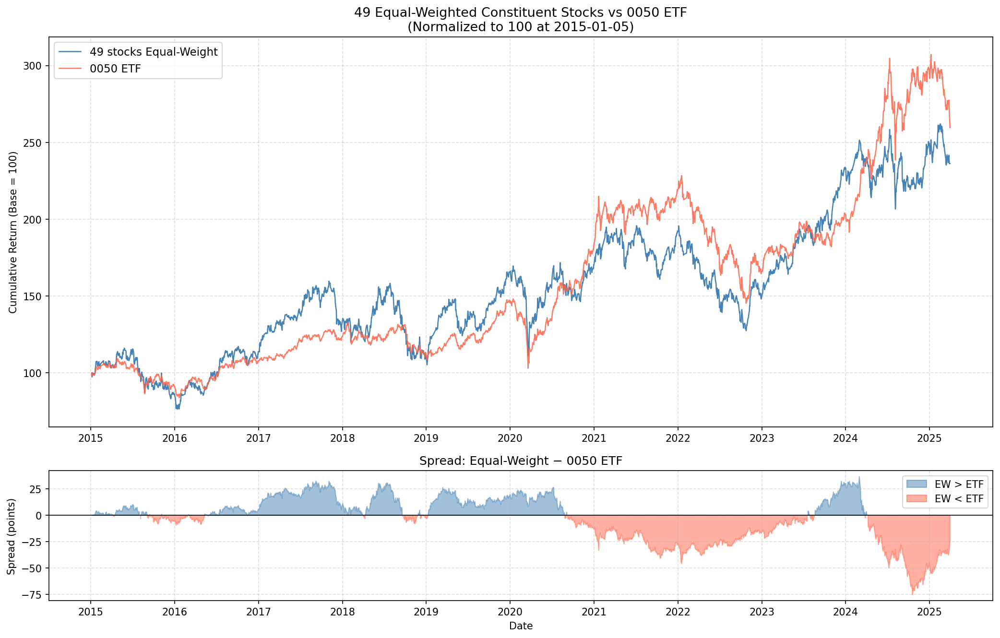

# 台股 0050 成分股股票池說明

> 脈絡：以元大台灣 50 ETF（0050）成分股為基礎，排除 1 支於資料起始日（2015-01-05）無交易紀錄的股票 → 最終保留 **49 支**完整資料期間成分股（2015-01-05 至 2025-03-31，共 2,673 個工作日）。

---

## 股票池選擇

以元大台灣 50 ETF（0050）成分股為基礎，成分股清單取自 `src/data/TWII/0050.xlsx`（50 支）。

本研究資料期間為 **2015-01-05 至 2025-03-31**，以此作為資料完整性篩選基準：

> 使用 yfinance 嘗試下載各股票在 2015-01-05 的資料；

排除結果如下：

| 股票代碼 | 股票名稱 | 排除原因 | 資料起始日 |
|----------|----------|----------|------------|
| 6669 | 緯穎 | 新公司 IPO 上市，於 2017-11-13 才開始交易 | 2017-11-13 |

最終採用 **49 支**資料期間完整的成分股進行實驗（共 2,673 個工作日；採用 `pd.bdate_range` 產生，僅排除週六日，未排除台灣國定假日）。

---

## 資料維度

本研究提供兩種特徵版本，均以相同的 49 支成分股為基礎：

| 資料路徑 | shape | 說明 |
|----------|-------|------|
| `src/data/TWII/feature5-Inter/stocks_data.npy` | `(49, 2673, 5)` | 5 維 OHLCV 基本特徵 |
| `src/data/TWII/feature34-Inter/stocks_data.npy` | `(49, 2673, 34)` | 34 維（OHLCV + 技術指標 + Alpha 因子） |

兩版本的前 5 維（OHLCV）完全一致（max diff = 0.0）。

報酬率序列：

| 資料路徑 | shape | 說明 |
|----------|-------|------|
| `src/data/TWII/feature5-Inter/ror.npy` | `(49, 2673)` | 日報酬率（以 Open 計算） |
| `src/data/TWII/feature34-Inter/ror.npy` | `(49, 2673)` | 同上 |

---

## 等權指數 vs 0050 ETF 比較

下圖比較 49 支成分股**等權平均收盤價**（每日對 49 支股票取算術平均）與 **0050 ETF（0050.TW）** 的走勢。

由於兩者的價格量綱不同（EW-49 均價約數百元、0050 ETF 約數十至兩百元），無法直接比較絕對價格；因此先將各序列除以起始日價格再乘以 100，即「對齊起點的標準化價格」。**此操作與繪製累積報酬曲線等價**：若 $P_t$ 為第 $t$ 日價格，$P_0$ 為起始日，則標準化後的數值為 $\frac{P_t}{P_0} \times 100$，其意義即為以 100 為基準的累積報酬。

**統計摘要（2015-01-05 至 2025-03-31，共 2,489 個交易日）：**

> 此處 2,489 為 EW-49 與 0050 ETF 兩序列取交集後的實際交易日數（0050 ETF 有成交紀錄的日期），少於 npy 資料的 2,673 個工作日。

| 指標 | 49支等權指數 | 0050 ETF |
|------|-------------|----------|
| 累積報酬 | +136.2% | +159.6% |
| 相關係數（r） | 0.9332 | — |
| 最大正偏差（EW > ETF） | +36.9 pp | — |
| 最大負偏差（EW < ETF） | −75.3 pp | — |

> **相關係數說明**：此處 r = 0.9332 為兩條**標準化價格水準序列（即累積報酬序列）**的皮爾森相關係數。由於兩序列均呈長期上升趨勢，水準序列的相關性天然偏高；若改以每日報酬率序列計算，係數通常會較低。本研究以此衡量「兩條走勢曲線的形狀相似度」，而非短期日報酬的同步性。

**觀察：**

1. **走勢高度相關**（r = 0.93），驗證以 49 支成分股代替 0050 ETF 的合理性。
2. **2015–2023 等權略優**：等權指數在多數時間稍高於 0050 ETF，因金融、傳產股等中小市值成分股均享有與台積電相同權重。
3. **2023–2025 ETF 大幅領先**：AI 驅動台積電（2330）市值暴漲，使市值加權的 0050 ETF 報酬顯著超越等權指數，最大負偏差達 75 個百分點。
